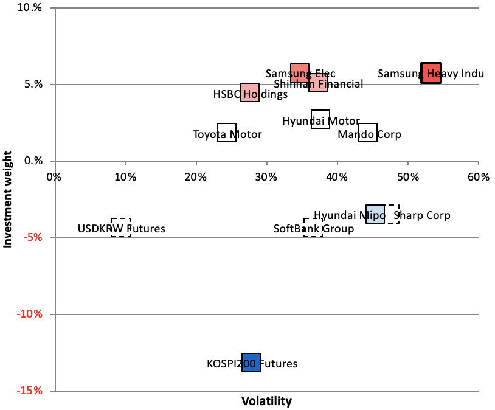
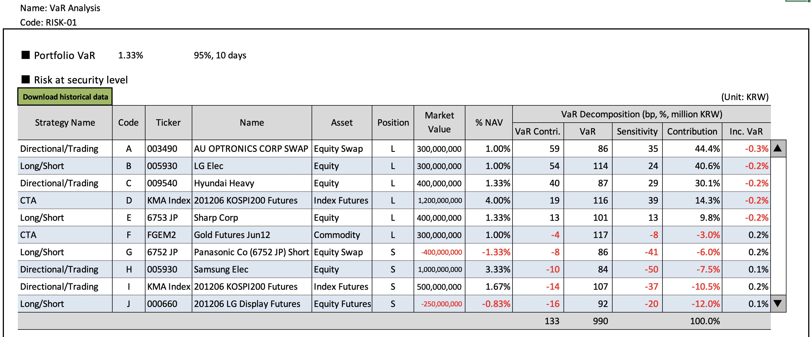

# My work as a Risk Manager
I, as a risk manager, specified risk management system requirements at work for hedge funds which were finally legalized in 2012 in South Korea. Since it's been more than seven years ago, this legacy system is *no longer used* now. Bloomberg **PORT** has replaced the system. Also, this work was done solely by me. I believe thus that it would have no adversarial effect to demenstrate my work with some screenshots of *Excel spreadsheets*, not even the real system, which I used for the specification:
- Volatility Decomposition
- VaR Analysis
- Performances and Risk Reports

**Relevant working experience**: January 2010 to February 2013 at Korea Investment Management (Seoul, KR)

This work was done in Korean, but I *translated* it to English for this posting without any further modification.

## I. Volatility Decomposition
I manually decomposes volatility (, which I take as risk) using Excel.
- Risk Sensitivity := Volatility of a single stock x Correlation of that stock with the portfolio
- Risk Contribution := Risk sensitivity of a single stock x Investment weight of that stock

### 1. Volatility Decomposition Table
Here's an example of how I specified a volatility decomposition requirement, which I passed to the internal technology team at work.

### 2. Volatility Decomposition by Colors
This plot efficiently summarizes the information above.

## II. VaR Analysis
We need VaR analysis in finer details for hedge funds because of various strategies within one hedge fund. So, my suggestion was to go from security-level, strategy-level and to country/sector-level analysis

#### Definitions
We intentionally use easier terms for communiations as follows:
  - Contributions is just a component VaR
  - Sensitivity is marginal VaR
  - % of Risk is percentage of sum of all contributions
  
Risk aggregation for a strategy-level analysis
  - SUM(VaR Contribution) = SUM(VaR contribution for each strategy)
  - VaR = SUM(VaR for each strategy)
  - Sensitivity = NAV-weight average(Sensitivity for each strategy)
  - Contribution = SUM(Contribution for each strategy)

## III. Performances and Risk Report

## IV. Due-diligence
I conducted due-diligence on nine hedge fund managers in New York with my colleagues and analysts at Albournce in April 2011. I wrote a full report about it, which obvisouly I am not allowed to share with here. Probably listing up questions in that report would be the best I can do to give you sense of my work.

### Questions in the due-diligence report
#### 1) How to calculate portfolio NAVs
- Is NAV pricing calculated by an independent fund service?
- What is your internal process when discrepency occurs in NAV pricing between your firm and the independent fund service?
- Historical records of re-announcing NAVs.
  - According to Stephen Brown(2011), 10% of hedge fund managers in average modifies a portfolio NAV at least once.

#### 2) Money transaction control
- The number of signatures required to complete money transactions. 
  - According to Stephen Brown(2011), an average of 1.7 signatures is needed.
- Limitation of receipiant imposed
- Existance of the 3rd-party reviewing money transactions

#### 3) Fund structures
- General information such as prime brokers, auditors, undisclosed investment activies in feeder funds (rather than mother funds) and etc.

#### 4) Operational Risk
- A turnover ratio
- Is your auditor one of Big 4?
- History of changing prime brokers, auditors and custodian banks.

#### 5) Market/Credit Risk
- Your definition of leverage
- Limits on leverage
- How to leverage (Creditline? Colateral? Derivatives?)
- Limits on loans
- Risk limits (on single positions, concentrations, country or sector levels and etc).
